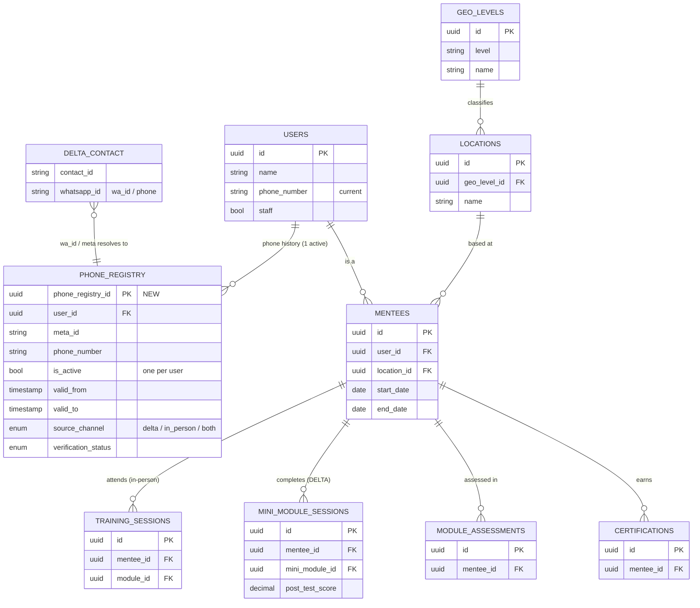

# Linking In-Person and Virtual (DELTA) Mentees — Data & Identity Plan

*Companion note to the probe "Linking In-Person and Virtual Mentorship," aligned to the MENTORS + DELTA database schema. Where the probe sets out the problem and the programmatic fix, this note describes how we operationalize that fix in the data layer, using the identifiers the schema already provides, and proposes a Phone Number Registry to manage the linkage reliably over time.*

## Terminology (aligned to the MENTORS model)

To keep this unambiguous for readers, we use the schema's own terms throughout:

- **User** (`users.id` = `user_id`) — the person. Carries identity and, today, a single `phone_number`. This is our **persistent, cross-channel anchor**.
- **Mentee** (`mentees.id` = `mentee_id`, linked to a user via `user_id`) — the person in the **learner** role. A mentee is the healthcare provider being trained; wherever the probe says "provider" or "learner," read **mentee**.
- **Mentor** — delivers mentorship; not the subject of this linkage.

We deliberately drop the earlier "Provider/Mentee ID" label: the anchor is `user_id`, and curriculum participation hangs off `mentee_id`.

## The core principle: collect the phone, anchor on the user (validated by the Meta ID)

DELTA is accessed through WhatsApp, so the WhatsApp phone number is the natural point of collection at enrolment. The key design decision is that the phone number is the **entry key, not the anchor**. At the back end, each WhatsApp phone resolves to a **user**, and the identity that persists across channels is the `user_id`. The Meta / WhatsApp account identifier is captured behind the scenes as a **validation** signal that stays stable even when the visible phone number changes. Identity is therefore layered:

- **Phone number** — easy to collect, but changeable and sometimes shared or duplicated.
- **Meta / WhatsApp account identifier** — captured behind the scenes; more persistent than the phone because it belongs to the account, not the SIM. Used to confirm a match.
- **`user_id`** — the durable anchor that both in-person and DELTA records resolve to. The mentee role (`mentee_id`) and all curriculum progress hang off it.

This is already partly in place. The DELTA pipeline captures each participant's WhatsApp identifier (`whatsapp_id`) alongside their profile — name, cadre, facility, county, enrolment date — keyed to a stable DELTA contact id, and the captured facility/county map naturally onto the model's `locations` / `geo_levels`. That gives us the DELTA-side raw material to resolve a WhatsApp contact to a `user`, and from there to their `mentee` record.

One honest caveat for planning: the identifier we currently receive from the WhatsApp integration is the account's `wa_id`, which today is tied to the phone number. Retrieving a Meta account identifier that provably survives a **number change on the same account** is the piece to confirm with the WhatsApp Business / Turn integration before committing to it as the sole validation mechanism. The registry below works whether that persistent identifier is available immediately or added later.

## Why phone numbers must be actively managed

Today the model holds one `phone_number` on `users`. That is enough to *message* a mentee, but not to *link reliably* across channels, because phone numbers fail as identifiers in predictable ways — each of which either **splits** one mentee into several records or **merges** several mentees into one:

- a mentee changes their number;
- a mentee uses more than one number;
- a mentee accesses DELTA through a different WhatsApp account;
- a mentee uses another person's device or a shared line.

The implication is that a phone number should be treated as a **time-bound attribute of a user**, not as identity. The registry gives us exactly that: full history, a single current number, and a resolution path back to the `user_id`.

## Proposed fix: a Phone Number Registry

A single authoritative table that extends `users.phone_number` into a managed history. It (a) records every phone number ever associated with a user, (b) resolves each to the `user_id` and Meta identifier, (c) enforces **exactly one active number per user at any time**, and (d) preserves complete history for audit and re-linkage. It relates one-to-many to `users` (`user_id`), and through `mentees.user_id` it connects to the mentee's curriculum records.

### The "one active number at a time" rule

The table uses slowly-changing-dimension (Type 2) history. Every number a user has held is a row, bounded by `valid_from` / `valid_to`; `is_active` marks the current one. When a user's number changes, we close the prior row (`valid_to` set, `is_active = false`) and open a new active row. A uniqueness rule guarantees at most one `is_active = true` row per `user_id` — so the current number is always unambiguous, while nothing is lost. The active row can also keep `users.phone_number` in sync as the single "current" value the rest of the system already expects.

### Schema

| Column | Type | Description |
|---|---|---|
| `phone_registry_id` | uuid | Surrogate primary key for the row. |
| `user_id` | uuid | FK to `users.id` — the persistent anchor. |
| `meta_id` | string | WhatsApp/Meta account identifier (the `wa_id` today; the persistent account id where available). |
| `phone_number` | string (E.164) | Normalized phone number (digits, country code included). |
| `is_active` | bool | Exactly one `true` per `user_id` — the user's current number. |
| `valid_from` | timestamp | When this number became active for the user. |
| `valid_to` | timestamp (nullable) | When it was superseded; `null` = current. |
| `source_channel` | enum | Where captured: `delta`, `in_person`, `both`. |
| `verification_status` | enum | `unverified`, `verified_whatsapp`, `verified_in_person`. |
| `change_reason` | enum | Why it changed: `new_number`, `new_account`, `correction`, `device_change`. |
| `superseded_by` | uuid (nullable) | `phone_registry_id` of the row that replaced this one (audit trail). |
| `is_shared_device` | bool | Flag where the number/device is known to be shared (linkage risk). |
| `opt_in_status` | bool | Messaging consent for this number. |
| `last_activity_at` | timestamp (nullable) | Last observed DELTA activity on this number (helps auto-flag dormant numbers). |
| `record_source` | string | Originating system (e.g. Turn/DELTA, in-person registry). |
| `created_at` | timestamp | Row creation. |
| `updated_at` | timestamp | Last modification. |
| `notes` | string (nullable) | Free-text context. |

The attributes beyond the obvious phone/id fields are the ones that earn their place: `verification_status` and `source_channel` tell us how much to trust a link and where it came from; `change_reason` + `superseded_by` give a clean audit trail when numbers move; `is_shared_device` surfaces the exact risk the probe raises; `last_activity_at` lets us retire stale numbers automatically; and `opt_in_status` keeps consent attached to the specific number.

### How it links the two channels

- **In-person enrolment** (creating/updating a `mentee` and its `user`) asks the intended channel (in person / DELTA / hybrid) and the WhatsApp number, writing a registry row against the `user_id`.
- **DELTA participation** arrives via WhatsApp; the back end resolves the `wa_id` / Meta identifier, matches it to the registry (`meta_id` first, `phone_number` as fallback), and attaches the same `user_id`.
- **Result:** the DELTA contact and the in-person `mentee` both resolve to one `user_id`. Through `mentees.user_id → mentee_id`, DELTA progress and in-person records (`training_sessions`, `mini_module_sessions`, `module_assessments`, `certifications`) roll into a single continuous curriculum view.

## Recommendation: capture WhatsApp numbers from in-person mentees

DELTA mentees supply a WhatsApp number by definition — it is how they reach the service. In-person mentees do not, and may register with a number that is not on WhatsApp at all. That gap is the single biggest limiter on linkage: without a WhatsApp number (and the Meta identifier behind it) for an in-person mentee, we cannot connect them to a present or future DELTA account, or confirm a match if their registration number later changes.

We therefore recommend a light, deliberate **nudge at in-person enrolment** — and at routine mentorship touchpoints — that asks every mentee to provide their WhatsApp number, explicitly flagging cases where it differs from the phone used to register. The ask should be low-friction and explained in plain terms ("this is how we keep your in-person and virtual progress connected") and paired with consent.

The payoff is coverage: the registry fills for **both** channels rather than DELTA alone. A mentee who starts in person and later joins DELTA (or the reverse) is already linked, hybrid journeys stitch together automatically, and match rates rise instead of leaving in-person-only mentees stranded as separate records. Practically, the WhatsApp number becomes an encouraged field at enrolment, written straight into the registry against the mentee's `user_id`.

## What this unlocks

With `user_id` as the anchor fed by the registry, the questions the probe raises become answerable: whether a curriculum activity was completed in person or on DELTA, which components remain outstanding **across both** channels, whether an in-person starter is continuing virtually, and whether we are double-counting the same mentee across systems. It also lets us relate overall mentorship engagement to **facility-level** quality-of-care trends (via `locations` / `geo_levels`) without turning individual observations into a performance tool.

## Privacy and governance

Phone numbers and Meta identifiers are personal data and stay inside a restricted layer — the same boundary we already enforce on DELTA, where identifiers live only in the protected profile model and reporting consumes a de-identified dimension. Analytics and dashboards should reference only `user_id` / `mentee_id`, never the phone or Meta ID. Consistent with the probe, **QuIPS remains separate**: mentee linkage applies to JH-enrolled mentees for programme administration only, and QuIPS observations stay facility-level and anonymous rather than mentee-level or punitive.

## How this maps to the MENTORS schema

- **Anchor already exists** — `users.id` is the persistent identifier; no new ID scheme is needed.
- **Phone already modelled** — `users.phone_number` becomes the "current value," with the registry providing the history and the one-active rule.
- **Learner linkage** — `mentees.user_id` connects the anchor to curriculum tables keyed on `mentee_id`.
- **Geography** — DELTA-captured facility/county align to `locations` / `geo_levels`.
- **New table** — the registry is an addition alongside the four new DELTA tables (`mini_modules`, `mini_module_sessions`, `module_feedback`, `module_questions`); it does not alter existing tables beyond keeping `users.phone_number` in sync.

## Data model (ER view)

The linkage spine reads left to right: a **DELTA contact** resolves (via `wa_id` / Meta ID) to a row in the **Phone Registry**, which points to a **user**; the user's **mentee** record carries curriculum progress from both in-person (`training_sessions`) and DELTA (`mini_module_sessions`) channels. The Phone Registry is the only new table.

## What is already in place, and what is next

**In place today:** the DELTA pipeline captures the WhatsApp identifier and mentee profile per contact, a de-identified reporting layer is built, and a clear PII boundary separates identifiers from reporting.

**Next steps:**

1. Confirm technical retrieval and persistence of the Meta account identifier beyond the phone number (WhatsApp Business / Turn integration) — the one open feasibility item.
2. Adopt `user_id` as the cross-channel anchor in both systems (no new ID to design).
3. Add a WhatsApp-number (and intended-channel) capture step to in-person mentee enrolment, with an explicit nudge for every mentee to provide their WhatsApp number (see *Recommendation* above).
4. Stand up the registry table and the matching/resolution logic (Meta ID first, phone fallback), keeping `users.phone_number` in sync.
5. Backfill the registry from existing DELTA contacts and `users.phone_number` to seed the first links.

## Decisions we need from leadership

- **Confirm `user_id` as the shared anchor** across in-person and DELTA (rather than a separate provider ID).
- **Sign-off to confirm Meta ID feasibility** with the integration provider.
- **Enrolment process change** to collect the WhatsApp number and intended channel in person.
- **Data governance approval** for storing phone and Meta identifiers, including consent handling.
